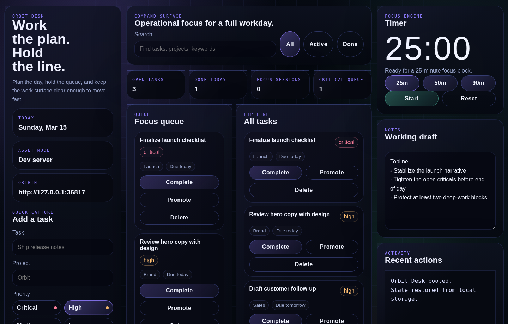
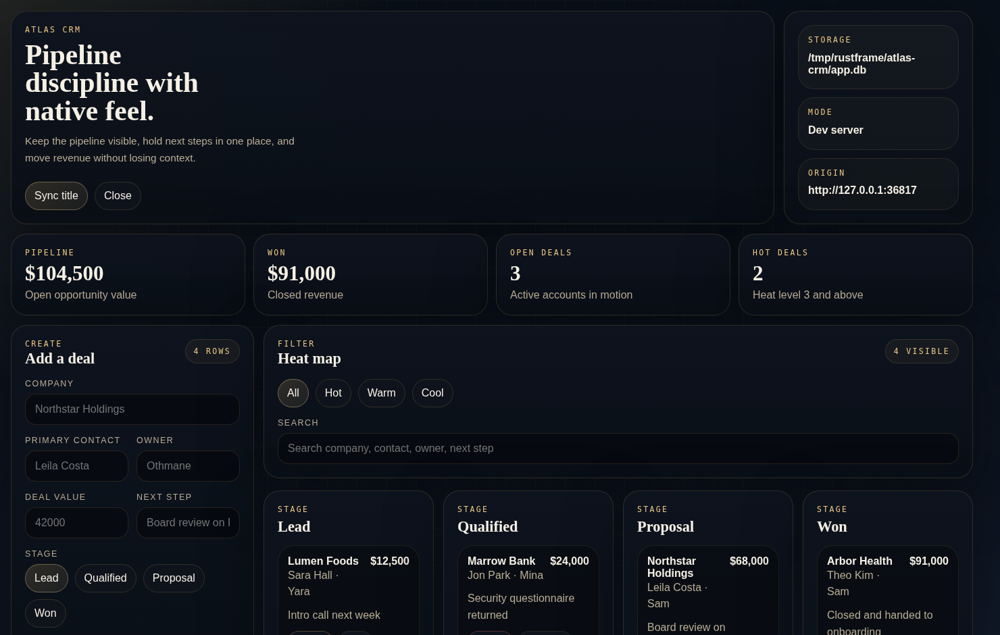
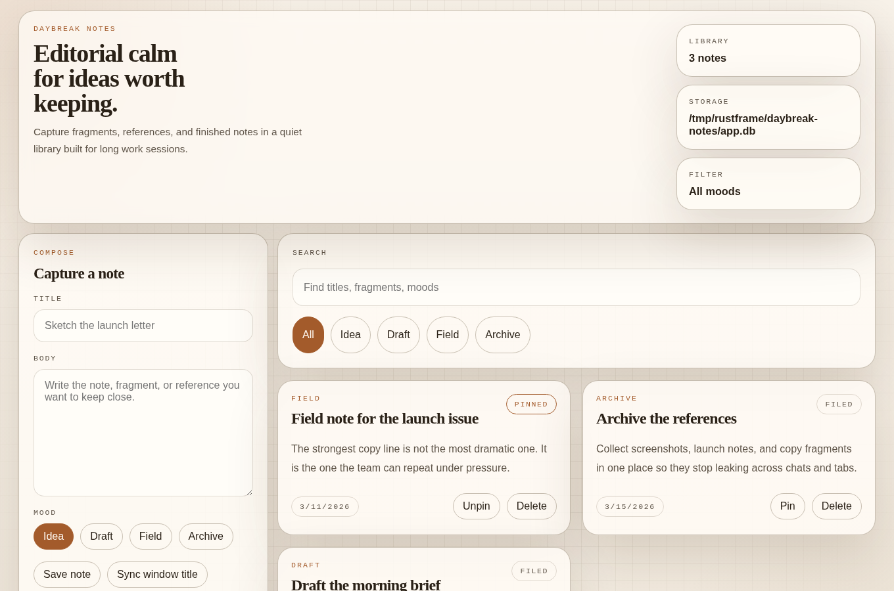
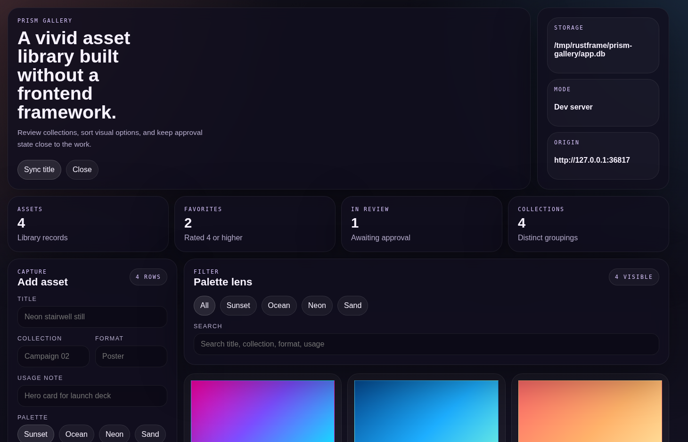
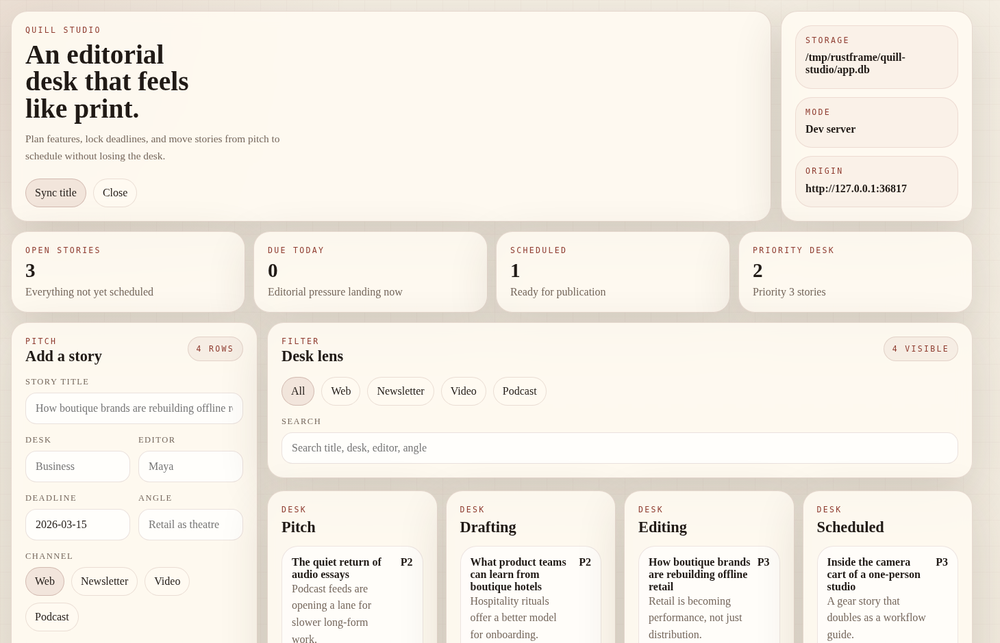

# RustFrame

<p align="center">
  <strong>Frontend-first desktop apps in Rust.</strong><br>
  Keep the app as plain web files. Let the runtime own the native shell.
</p>

<p align="center">
  <a href="docs/getting-started.md">Getting Started</a>
  ·
  <a href="docs/runtime-and-capabilities.md">Runtime And Capabilities</a>
  ·
  <a href="FRONTEND_APP_RULES.md">Frontend App Rules</a>
  ·
  <a href="docs/example-apps.md">Example Apps</a>
</p>

<p align="center">
  RustFrame exists for the gap between "I can build this as a frontend" and "now I have to adopt a whole desktop framework mindset."
</p>

<p align="center">
  
  
</p>
<p align="center">
  
  
  
</p>

RustFrame is a stripped-down desktop application framework in Rust for local-first tools, internal software, and desktop apps that should stay mostly frontend code.

Great desktop tools already exist. But for small and simple use cases, they can still feel like too much machinery:

- too much visible native project structure around every app
- too much framework ceremony for something that is mostly HTML, CSS, and JavaScript
- too many layers between "I need a native window" and "I can ship this"
- too much desktop-specific architecture for apps that should have stayed easy to read

RustFrame makes a narrower bet:

> a desktop app can just be a frontend folder

That means the app in `apps/<name>/` stays plain, while RustFrame handles the native window, embedded assets, IPC bridge, packaging flow, and optional local capabilities behind the scenes.

## The Problem

For a lot of desktop apps, the hard part is not the UI.

It is everything that shows up around the UI:

- the runner
- the bridge
- the plugin model
- the config sprawl
- the packaging story
- the database and migration glue

If you are building a notes app, a small CRM, an internal tool, or a local-first utility, that overhead is often larger than the app itself.

RustFrame is for that exact situation.

This is not an anti-framework pitch.

If Tauri, Electron, Wails, or a full native stack already fits your product, use them.
RustFrame exists for the smaller slice where those tools can feel broader, heavier, or more ceremonial than the app actually needs.

## The RustFrame Bet

Instead of asking you to turn every app into a visible native project, RustFrame keeps the default authoring model aggressively small:

```text
apps/hello-rustframe/
├── index.html
├── styles.css
├── app.js
├── rustframe.json
├── assets/
└── data/
    ├── schema.json
    ├── seeds/
    └── migrations/
```

What happens around that folder is runtime-owned:

- the native bridge is injected by RustFrame
- assets are embedded into the binary
- the hidden runner is generated under `target/rustframe/apps/<name>/runner/`
- SQLite turns on when the app declares schema files
- filesystem and shell access stay unavailable unless the app explicitly declares them
- `rustframe-cli eject <name>` gives you an app-owned native runner later, without forking the runtime

This is the core design point: start small, stay readable, and only graduate to more native control when the app actually needs it.

## Why It Feels Smaller

RustFrame is opinionated in ways that reduce overhead for small desktop products:

| Area | RustFrame |
| --- | --- |
| App model | Frontend-first app folders with plain HTML, CSS, JS, and a typed `rustframe.json` manifest |
| Bridge | Runtime-injected `window.RustFrame`, not a per-app localhost bridge or plugin marketplace |
| Native data | Embedded SQLite with schema files, one-time seeds, and versioned SQL migrations |
| Security | Explicit trust model with `local-first` and `networked` boundaries |
| Native access | Root-scoped filesystem reads and hardened shell allowlists |
| Windows | Route-scoped multi-window support on one runtime event loop |
| Distribution | `export`, `platform-check`, and host-native `package` flows |
| Escape hatch | `eject` creates an app-owned runner only when you outgrow the hidden path |

## Start In Minutes

Prerequisites:

- Rust and Cargo
- a native host toolchain for the platform you are targeting
- Linux uses the GTK and WebKitGTK stack required by `wry`
- Windows uses the MSVC Rust toolchain
- macOS uses Xcode command line tools

Run the capability demo:

```bash
cargo run -p capability-demo
```

Create an app:

```bash
cargo run -p rustframe-cli -- new hello-rustframe
```

Run it:

```bash
cargo run -p rustframe-cli -- dev hello-rustframe
```

Export the raw binary:

```bash
cargo run -p rustframe-cli -- export hello-rustframe
```

Validate the host support row:

```bash
cargo run -p rustframe-cli -- platform-check hello-rustframe
```

Package a host-native bundle:

```bash
cargo run -p rustframe-cli -- package hello-rustframe
```

If you want frontend tooling during development, point RustFrame at a dev server:

```bash
cargo run -p rustframe-cli -- dev hello-rustframe http://127.0.0.1:5173
```

For the full step-by-step path, read [docs/getting-started.md](docs/getting-started.md).

## What You Actually Configure

RustFrame uses `rustframe.json` as the primary typed app contract:

```json
{
  "appId": "hello-rustframe",
  "window": {
    "title": "Hello Rustframe",
    "width": 1280,
    "height": 820
  },
  "security": {
    "model": "local-first"
  },
  "devUrl": "http://127.0.0.1:5173"
}
```

That same manifest can also declare:

- packaging metadata for Linux, Windows, and macOS
- filesystem roots
- hardened shell commands
- trust-model overrides for bridge namespaces

HTML metadata still works as fallback, but the manifest is the long-term typed path.

## What RustFrame Already Ships

This repo is not just a tiny starter and a promise.

RustFrame already includes:

- a runtime crate built on `tao` and `wry`
- a CLI that can `new`, `dev`, `export`, `platform-check`, `package`, and `eject`
- runtime-injected bridge ownership instead of per-app bridge duplication
- multi-window support
- SQLite with embedded schema files, seeds, and versioned migrations
- explicit filesystem and shell capability declarations
- a frontend trust model with `local-first` and `networked` modes
- host-native Linux, Windows, and macOS packaging flows
- end-to-end runtime and export smoke coverage

## Example Apps In This Repo

The repo ships eleven example apps plus a capability demo:

- `hello-rustframe`
- `daybreak-notes`
- `atlas-crm`
- `dispatch-room`
- `ember-habits`
- `harbor-bookings`
- `ledger-grove`
- `meridian-inventory`
- `orbit-desk`
- `prism-gallery`
- `quill-studio`

These examples matter because they prove the same runtime can already carry:

- notes apps
- CRM workflows
- inventory surfaces
- editorial boards
- habits and planning tools
- media-heavy local desktop interfaces

This is not just a thesis about simplicity. It is a tested authoring model with real UI density behind it.

## When RustFrame Is The Right Call

RustFrame is a strong fit when you want:

- a local-first desktop app that should stay mostly frontend code
- internal software that needs a native shell without framework sprawl
- a solo-dev or small-team desktop product that should move fast
- a clean path from plain frontend assets to packaged native bundles

If you already need a large plugin ecosystem, very deep desktop integration from day one, or a VS Code-class surface area, RustFrame is intentionally not aiming there first.

## Current Limitations

RustFrame is promising, but it is still honest software:

- native packaging and validation now exist on Linux, Windows, and macOS hosts, but cross-host validation still needs the matching native toolchain
- signing, notarization, first-class installers, and update channels are still early
- Linux still has extra runtime constraints around GTK/WebKitGTK and X11 vs Wayland

That is a conscious tradeoff for simplicity today, not the end state.

## Repo Map

- `crates/rustframe`
  Reusable runtime crate.
- `crates/rustframe-cli`
  Scaffolding, validation, export, packaging, and ejection tooling.
- `examples/capability-demo`
  Sample app showing the native bridge, filesystem scope, and shell execution model.
- `apps/*`
  Frontend-first example apps.
- `docs/`
  Product and implementation docs.
- `site/`
  Portable static project site derived from the repo itself.

## Read Next

- [Getting Started](docs/getting-started.md)
- [Runtime And Capabilities](docs/runtime-and-capabilities.md)
- [Frontend App Rules](FRONTEND_APP_RULES.md)
- [Example Apps](docs/example-apps.md)

If this README resonates, the best next move is still the simplest one:

```bash
cargo run -p capability-demo
```
