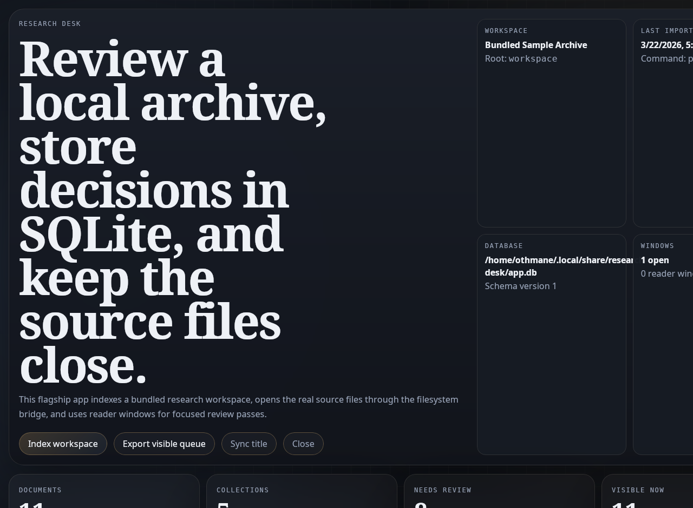

# RustFrame

<p align="center">
  <strong>Local-first desktop workflow tools with mostly frontend code.</strong><br>
  Keep the app as plain web files. Let the runtime own the native shell, embedded SQLite, and scoped machine access.
</p>

<p align="center">
  <a href="docs/getting-started.md">Getting Started</a>
  ·
  <a href="docs/choosing-rustframe.md">Choosing RustFrame</a>
  ·
  <a href="docs/architecture-overview.md">Architecture Overview</a>
  ·
  <a href="docs/runtime-and-capabilities.md">Runtime And Capabilities</a>
  ·
  <a href="FRONTEND_APP_RULES.md">Frontend App Rules</a>
  ·
  <a href="docs/example-apps.md">Example Apps</a>
</p>

<p align="center">
  
</p>

RustFrame is a Rust workspace for building local-first desktop tools where the app should stay mostly HTML, CSS, and JavaScript.

It is not trying to win every desktop use case. It is aimed at a narrower slice:

- personal and internal desktop tools
- structured local data apps
- file-centric workflow surfaces
- apps that need a native window, embedded SQLite, and some scoped machine access
- developers who want a frontend-first authoring model without turning every app into a visible native project

## The Short Version

RustFrame exists for this gap:

> I can build the product as a frontend, but I still need a real desktop shell, local data, and a few native capabilities.

That gap is where a normal browser tab often stops being enough, but a full desktop framework can feel broader than the job.

RustFrame keeps the default authoring model small:

```text
apps/<name>/
├── index.html
├── styles.css
├── app.js
├── rustframe.json
├── assets/
└── data/
    ├── schema.json
    ├── seeds/
    └── migrations/
```

The runtime owns the rest:

- the native window
- the injected `window.RustFrame` bridge
- embedded assets
- the hidden runner
- SQLite provisioning and migrations
- scoped filesystem access
- allowlisted shell execution
- packaging and host validation

## What RustFrame Is For

RustFrame is strongest when you are building tools like:

- a local research desk that stores notes, tags, and imported files in SQLite
- a media review workbench that indexes local assets and runs approved ingest commands
- an operations runbook desktop app with structured records, offline data, and multi-window views

The common pattern is the point:

- frontend-heavy UI
- local-first data
- a native shell
- a few carefully scoped machine capabilities

## Flagship Workflow

The current flagship app is `apps/research-desk`.

It is the clearest answer to "what is this useful for?":

- indexes a bundled local archive into SQLite
- reads the real source files through scoped filesystem roots
- runs an allowlisted Python indexer from the UI
- opens dedicated reader windows for focused review
- exports the visible review queue

If you want to evaluate RustFrame today, run `research-desk` before you judge the rest of the example set.

## Use RustFrame When

- Your app should stay mostly frontend code.
- You want embedded SQLite without building the entire desktop stack yourself.
- You need a native window, packaging flow, and limited native access.
- You want filesystem or shell access to be explicit and scoped in the manifest.
- You want an escape hatch later, not a large native project on day one.

## Do Not Use RustFrame When

- You already know you need deep native APIs immediately.
- You need a large plugin ecosystem or many desktop integrations from day one.
- You are building a browser-first product that works fine as a tab or PWA.
- You want a mature general-purpose framework with a broad community surface today.
- You are building a VS Code class app or anything with very deep platform coupling.

If you are already happy in Tauri, Electron, Wails, or a full native stack, use the tool that fits your product.

## Why It Exists

For many local tools, the hard part is not the UI.

It is everything that shows up around the UI:

- the native project
- the bridge setup
- the packaging path
- the database glue
- the capability boundaries
- the gradual move from "simple app" to "needs more native control"

RustFrame tries to make that path feel smaller without pretending the desktop disappears.

## What Already Ships

This repo already includes:

- a runtime crate built on `tao` and `wry`
- a CLI that can `new`, `dev`, `export`, `platform-check`, `package`, and `eject`
- runtime-injected `window.RustFrame` ownership instead of per-app bridge duplication
- embedded SQLite with schema files, seeds, and versioned SQL migrations
- scoped filesystem and hardened shell capabilities declared in `rustframe.json`
- a frontend trust model with `local-first` and `networked` boundaries
- multi-window support
- host-native packaging flows for Linux, Windows, and macOS
- automated tests and workflow smoke coverage

## Why Not Just A Browser?

A browser tab is still the right answer for many apps.

RustFrame matters when you need some combination of:

- packaged desktop distribution
- a native window and window management
- embedded local SQLite controlled by the runtime
- manifest-scoped filesystem access
- allowlisted process execution
- a frontend that is trusted differently depending on the app's security model

If you do not need those things, the browser is simpler.

## Start In Minutes

Prerequisites:

- Rust and Cargo
- a native host toolchain for the platform you are targeting
- Linux uses the GTK and WebKitGTK stack required by `wry`
- Windows uses the MSVC Rust toolchain
- macOS uses Xcode command line tools

Run the flagship workflow app:

```bash
cargo run -p rustframe-cli -- dev research-desk
```

That app is the best current proof of the wedge: a local archive review tool with SQLite, scoped filesystem access, allowlisted automation, and reader windows.

Run the capability demo:

```bash
cargo run -p capability-demo
```

Create an app:

```bash
cargo run -p rustframe-cli -- new hello-rustframe
```

Run it:

```bash
cargo run -p rustframe-cli -- dev hello-rustframe
```

Export the raw binary:

```bash
cargo run -p rustframe-cli -- export hello-rustframe
```

Package a host-native bundle:

```bash
cargo run -p rustframe-cli -- package hello-rustframe
```

If you want frontend tooling during development, point RustFrame at a dev server:

```bash
cargo run -p rustframe-cli -- dev hello-rustframe http://127.0.0.1:5173
```

## What You Configure

RustFrame uses `rustframe.json` as the primary app contract:

```json
{
  "appId": "hello-rustframe",
  "window": {
    "title": "Hello Rustframe",
    "width": 1280,
    "height": 820
  },
  "security": {
    "model": "local-first"
  },
  "devUrl": "http://127.0.0.1:5173"
}
```

That manifest can also declare:

- filesystem roots
- shell commands
- security overrides
- packaging metadata
- per-platform icons and bundle settings

## What The Example Set Proves

The repo now ships one flagship workflow app, a capability demo, and a wider reference set.

Today they prove that the same runtime can already support:

- one credible file-centric workflow app, not just UI variety
- frontend-only apps
- SQLite-backed apps
- multi-window workflows
- filesystem and shell capabilities
- different UI directions without changing the runtime contract

The important change is that `apps/research-desk` is now the main story and the rest of the examples are references around it.

## Current Limitations

RustFrame is promising, but still early:

- the ecosystem is small
- deep native integrations are not the main path yet
- signing, notarization, update channels, and production polish are still early
- Linux still carries heavier GTK, WebKitGTK, and display-stack constraints
- cross-host validation still requires the matching native host toolchain

These are not footnotes. They define the shape of the project today.

## Repo Map

- `crates/rustframe`
  Reusable runtime crate.
- `crates/rustframe-cli`
  Scaffolding, validation, export, packaging, and ejection tooling.
- `examples/capability-demo`
  Sample app showing the native bridge, filesystem scope, and shell execution model.
- `apps/research-desk`
  Flagship local archive review workflow.
- `apps/*`
  Smaller reference apps and templates.
- `docs/`
  Product and implementation docs.
- `site/`
  Portable static site derived from the repo.

## Read Next

- [Getting Started](docs/getting-started.md)
- [Choosing RustFrame](docs/choosing-rustframe.md)
- [Architecture Overview](docs/architecture-overview.md)
- [Runtime And Capabilities](docs/runtime-and-capabilities.md)
- [Frontend App Rules](FRONTEND_APP_RULES.md)
- [Example Apps](docs/example-apps.md)

The right next move is still the simplest one:

```bash
cargo run -p capability-demo
```
