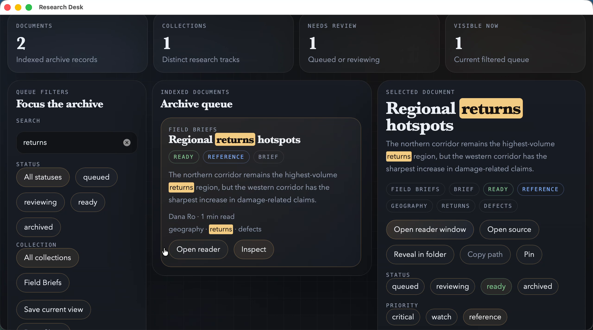

<div align="center">


### Turn local documents into a desktop workflow.

Build research desks, review queues and offline catalogs with TypeScript, SQLite and native file access. RustFrame supplies the desktop runtime and packaging; you build the workflow in your usual frontend stack. Rust is required to compile the native app, but you do not need to write the backend.

[](https://github.com/OthmaneBlial/rustframe/actions/workflows/ci.yml) [](https://github.com/OthmaneBlial/rustframe/actions/workflows/package-verify.yml) [](https://github.com/OthmaneBlial/rustframe/actions/workflows/security.yml) [](https://github.com/OthmaneBlial/rustframe/actions/workflows/codeql.yml) [](https://scorecard.dev/viewer/?uri=github.com/OthmaneBlial/rustframe) [](https://www.rust-lang.org/tools/install) [](LICENSE)

[Website](https://othmaneblial.github.io/rustframe/) · [Quickstart](#from-empty-folder-to-desktop-app) · [Why RustFrame](#a-small-framework-for-real-local-work) · [Security](#local-access-with-an-explicit-boundary) · [Support](SUPPORT.md) · [Packaging](#real-native-packages) · [Benchmarks](https://othmaneblial.github.io/rustframe/benchmarks.html) · [Case study](https://othmaneblial.github.io/rustframe/docs.html?doc=research-desk-architecture) · [Docs](https://othmaneblial.github.io/rustframe/docs.html) · [Showcase](https://othmaneblial.github.io/rustframe/showcase.html)

</div>

> **Release candidate:** `0.1.0-rc.4` is the fourth public v1 candidate. Framework CLI artifacts are published through GitHub Releases; the crates.io candidate remains `0.1.0-rc.1`. The `rustframe-api` npm package is still awaiting its initial 2FA-authorized publication, so a generated project's dependency install is not yet a supported public path.

[](docs/native-demo.md)

**Real native demo:** folder selection, SQLite search, review notes, reader synchronization and JSONL export on macOS ARM. [Download the short demo MP4](https://github.com/OthmaneBlial/rustframe/releases/download/v0.1.0-rc.4/rustframe-demo.mp4) · [Download the narrated explainer](https://github.com/OthmaneBlial/rustframe/releases/download/v0.1.0-rc.4/rustframe-explainer.mp4) · [Local playback and provenance](docs/native-demo.md) · [Explainer notes](docs/explainer-video.md). The Research Desk preview remains unsigned; the release assets include EN/FR captions and posters.

## From empty folder to desktop app

Install [Rust 1.88+](https://www.rust-lang.org/tools/install) and [Node.js 20+](https://nodejs.org/). Install the prebuilt CLI on macOS or Linux:

```bash
curl --proto '=https' --tlsv1.2 -LsSf \
  https://github.com/OthmaneBlial/rustframe/releases/download/v0.1.0-rc.4/rustframe-cli-installer.sh | sh
```

On Windows PowerShell:

```powershell
powershell -ExecutionPolicy Bypass -c "irm https://github.com/OthmaneBlial/rustframe/releases/download/v0.1.0-rc.4/rustframe-cli-installer.ps1 | iex"
```

Building the CLI from source remains available:

```bash
cargo install --git https://github.com/OthmaneBlial/rustframe \
  --tag v0.1.0-rc.4 rustframe-cli --locked
```

Then create the project:

```bash
rustframe doctor
rustframe new my-tool --template vanilla-ts --package-manager npm
cd my-tool
npm install # available after rustframe-api reaches npm
rustframe dev
```

That creates an independent Vite project wherever you are—not a workspace member, not a repository clone, and not a hidden path back to RustFrame's source tree.

```text
my-tool/
├── rustframe.json             # versioned native and security contract
├── package.json
├── index.html
├── src/
│   ├── main.ts
│   └── rustframe.generated.ts # table-aware database types
├── data/
│   ├── schema.json
│   ├── seeds/
│   └── migrations/
├── public/
└── assets/
```

The default is vanilla TypeScript. First-party starters are also available for plain JavaScript, React, Vue, and Svelte:

```bash
rustframe new notes      --template vanilla-js
rustframe new dashboard  --template react-ts
rustframe new catalog    --template vue-ts
rustframe new studio     --template svelte-ts
```

Interactive terminals can choose the template and package manager for you. Use flags when creation must be deterministic.

## A small framework for real local work

RustFrame is deliberately narrower than Tauri or Electron. It is designed for tools whose value lives in a workflow: research desks, document organizers, media review queues, CRUD workbenches, operations consoles, and offline-first internal applications.

| You write | RustFrame owns |
| --- | --- |
| HTML, CSS, TypeScript or JavaScript | Native windows and OS WebView lifecycle |
| A Vite frontend in any directory | Hidden Rust runner generation and compilation |
| `data/schema.json` | Embedded SQLite, migrations, transactions, backup and restore |
| Window-scoped permissions | Native IPC authorization, limits and audit records |
| User-facing workflow logic | Grants, watchers, file-open routing, dialogs, events and packaging |

There are three coordinated public packages:

| Package | Role |
| --- | --- |
| [`rustframe-cli`](https://crates.io/crates/rustframe-cli) | Installs the `rustframe` command and owns creation, development, validation, building, migration, diagnostics, and packaging. |
| [`rustframe-runtime`](https://crates.io/crates/rustframe-runtime) | The native runtime crate, imported in Rust as `rustframe`; generated runners use the exact compatible version. |
| [`rustframe-api`](https://www.npmjs.com/package/rustframe-api) | Typed frontend bridge, stable errors, complete request/event types, and generic database clients. |

```text
rustframe.json + frontend + data/schema.json
                      │
              validate / codegen
                      │
                      ▼
          target/rustframe/runner
                      │
           native window + typed IPC
                      │
        ┌─────────────┼──────────────┐
        ▼             ▼              ▼
      SQLite    scoped file grants   bounded commands
```

The generated runner stays under `target/rustframe/`. If an application genuinely needs custom native Rust, `rustframe eject` materializes it under `native/` and hands you ownership.

## TypeScript-first, JavaScript-friendly

Define tables once in `data/schema.json`, then let RustFrame generate deterministic record, insert, update, and table-map types:

```json
{
  "version": 1,
  "tables": [{
    "name": "work_items",
    "columns": [
      { "name": "title", "type": "text", "required": true },
      { "name": "lane", "type": "text", "default": "Inbox" },
      { "name": "priority", "type": "text", "default": "normal" }
    ]
  }]
}
```

This minimal schema supplies the table used below; RustFrame adds record IDs and timestamps. Keep existing project columns when adapting an already populated schema.

```bash
rustframe codegen
```

```ts
import { getRustFrame } from "rustframe-api";
import type { AppRustFrameClient } from "./rustframe.generated";

const rustframe = getRustFrame() as AppRustFrameClient;

const item = await rustframe.db.insert("work_items", {
  title: "Review interview notes",
  lane: "Inbox",
  priority: "high"
});

const [updated] = await rustframe.db.batch([
  {
    operation: "update",
    table: "work_items",
    id: item.id,
    patch: { lane: "Reviewing" }
  }
] as const);
```

The whole batch commits in one SQLite transaction or rolls back together. Successful mutations emit database-change events to every open application window after commit.

Plain JavaScript projects receive JSDoc output and can use either `getRustFrame()` or the injected `window.RustFrame` global—no TypeScript compiler required.

## Local access with an explicit boundary

Frontend code does not receive arbitrary absolute paths as its primary API. A person chooses a file or folder, RustFrame returns an opaque grant, and every later operation is resolved and authorized in native code.

```ts
const workspace = await rustframe.fs.requestGrant({
  kind: "directory",
  access: "read-write",
  persist: true,
  title: "Choose a document workspace"
});

if (workspace) {
  const documents = await rustframe.fs.walk(workspace.uri, {
    recursive: true,
    extensions: ["md", "txt"],
    limit: 10_000
  });

  const watcher = await rustframe.fs.watch(workspace.uri, { recursive: true });
  const stopListening = rustframe.events.onFilesystemChange(event => {
    console.log(event.operation, event.uri);
  });

  // Later: stopListening(); await rustframe.fs.unwatch(watcher.id);
}
```

`grant://…` and `root://…` URIs are checked against access mode, revocation state, traversal attempts, and symlink escapes. Watchers are cleaned up when their owning window closes or their grant is revoked.

## Security is part of the project contract

`rustframe.json` schema version 1 declares what each window may do:

```json
{
  "$schema": "https://othmaneblial.github.io/rustframe/schemas/v1/rustframe.schema.json",
  "schemaVersion": 1,
  "security": {
    "model": "local-first",
    "csp": "default-src 'self'; script-src 'self'; style-src 'self'; object-src 'none'; base-uri 'none'; frame-ancestors 'none'",
    "permissions": [
      {
        "window": "main",
        "allow": [
          "db:read",
          "db:write",
          "fs:grants:read",
          "fs:grants:watch",
          "dialog:open",
          "window:create"
        ]
      },
      {
        "window": "reader-*",
        "allow": ["db:read", "db:write"]
      }
    ]
  }
}
```

Permissions are enforced inside native IPC—not only hidden or disabled in JavaScript. Validation rejects unknown permissions, undeclared windows, unsafe paths, weak CSPs, missing assets, duplicate capability IDs, invalid commands, stale generated types, and local capabilities attached to a `networked` frontend.

Sensitive operations also have request-size limits, per-window rate limits, bounded output, timeouts, and redacted structured audit records. Remote production navigation is disabled, and RustFrame collects no telemetry by default.

Read the [threat model](docs/threat-model.md) and [security policy](SECURITY.md) before distributing an application.

## Developer tools

The CLI creates projects, validates permissions, generates database types, runs the frontend and native app, and builds installers. It also provides backup/restore, portable exports, diagnostics and release verification.

Start with [the developer loop](docs/developer-loop.md), [capability inspection](docs/local-first-and-capabilities.md) and [release verification](docs/release-verification.md). Run `rustframe --help` for the complete command list.

## Real native packages

```bash
rustframe validate
rustframe build
rustframe package --verify
```

Packaging is powered by `cargo-packager` and produces host-native artifacts under `dist/packages/`:

| Host | Formats |
| --- | --- |
| macOS | `.app`, `.dmg` |
| Windows | NSIS `.exe`, `.msi` |
| Linux | AppImage, Debian `.deb` |

Packaging CI is configured to build, install, smoke-launch and uninstall each format on its native host. This roadmap execution verified the macOS ARM package locally; current Windows/Linux native receipts remain a release gate. RustFrame also writes `SHA256SUMS`, a machine-readable package manifest, and release notes. Local unsigned builds remain supported and are labeled honestly; signing and notarization hooks are available for release pipelines. Built-in auto-updating is intentionally outside v1.

## Research Desk: the proof app

[`apps/research-desk`](apps/research-desk) is a useful application, not a capability showroom. It uses only public RustFrame APIs to:

- let a person choose any Markdown or text-document folder;
- persist access only with explicit consent;
- index and incrementally watch files without Python or another external runtime;
- provide full-text search, collections, tags, notes, review status, pinning, and saved filters;
- synchronize focused reader windows through database events;
- switch recent workspaces, export queues, and back up or restore SQLite;
- surface renamed, deleted, unreadable, and unsupported files instead of inventing activity.

Run it from this repository using the integration-only runtime override:

```bash
export PATH="$HOME/.cargo/bin:$PATH"
export RUSTFRAME_RUNTIME_PATH="$PWD/crates/rustframe"
cargo run -p rustframe-cli -- --project apps/research-desk dev
```

The override is for RustFrame's own integration work only. Generated public projects always depend on the registry runtime.

## When to choose something else

Choose RustFrame when local data and a focused machine workflow are central, the application is mostly frontend code, and a small explicit native surface is an advantage.

Choose Tauri or Electron when you need a broad plugin ecosystem, mobile targets, tray APIs, notifications, global shortcuts, Chromium consistency, or deep native integration from day one. RustFrame is not trying to win on framework breadth.

## Documentation

- [Start here](docs/README.md)
- [Getting started](docs/getting-started.md)
- [Build a packaged tool](docs/build-in-20-minutes.md)
- [Architecture](docs/architecture-overview.md)
- [Runtime and capabilities](docs/runtime-and-capabilities.md)
- [Local-first and capability inspection](docs/local-first-and-capabilities.md)
- [Portable data exports](docs/portable-data-exports.md)
- [Release verification](docs/release-verification.md)
- [Developer loop and diagnostics](docs/developer-loop.md)
- [Single-instance file-open routing](docs/file-open-routing.md)
- [Cookbook](docs/cookbook.md)
- [Workflow guides](docs/workflow-guides.md)
- [Generated frontend API reference](docs/api-reference.md)
- [Generated manifest reference](docs/manifest-reference.md)
- [Troubleshooting](docs/troubleshooting.md)
- [Manifest migration and versioning](docs/migrations-and-versioning.md)
- [Platform support](docs/platform-support.md)
- [Signing and notarization](docs/signing-and-notarization.md)
- [Update strategy](docs/update-strategy.md)
- [Contributing](CONTRIBUTING.md)

RustFrame's runtime, CLI, manifest, and frontend API contracts follow semantic versioning. The manifest schema URL is immutable for schema v1.

---

<div align="center">

**Build the workflow. Keep the data. Ship the desktop app.**

</div>
